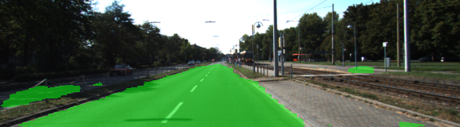
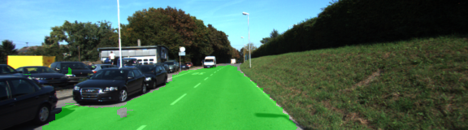
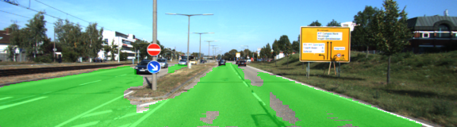
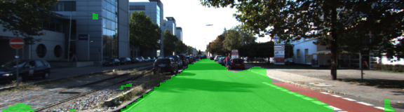

# Writeup

Results achieved using most recent architecture
iou=0.90,
true-positives=0.84 (% of road pixels),
false-positives=0.03 (% of non-road pixels)

On test set results are not fantastic and need to improved even so they are acceptable by project criterias.

Some examples from test data set:

## Network Architecture

Final implementation contains next layers on top of VGG16 network.

* transpose convolution x2. Amount of filters is set to 512 to match vgg shape for skip connection logic
* skip connection - vgg_layer_4 added with weight 1e-4 (per recommendation from forum)
* transpose convolution x2
* skip connection merge with vgg_layer_3 with weight 0.01
* transpose convolution x4

History of network evolution:
1) initially I had 1x1 convolution afte last layer of VGG but removing it did not reduce accuracy and improved computation time
2) at some point I decided to add stop_gradien_propagation to the last layer of VGG network - it proved to have no significant reduction in quality but made traning much faster

## Further improvements
1) Current approach does not have a proper train/test split to perform validation of the results
2) Based on visually observed results on test data set - model should benefit from augmenting training data set. Especially changing brightness conditions can potentially help reduce misses based on lighting conditions
3) Training end-to-end can definitely improve accuracy (remove stop_gradien_propagation) - but should probably be applied as a last measure
4) One of the radical ways to try out would be to change network architecture to Faster-RCCN based, similar to what was used by winners of last kaggle competition

## Metrics

Code: `main.py:106`

* iou - intersection over union usin TF embedded function
* true-positives out of all road pixels - % of correctly identified pixel (requirement: more than 80%)
* false-positives out of all non-road pixels - % of non-road pixels classified as road (requirement: less than 20%)

## Implementation Plan

* ~~Basic structure~~
* Save loss history to compare between experiments (in log for now)
* Way to visualize loss over epochs
* ~~Add proper calculation of true-positives-road, false-positives-non-road~~
* augment images with brightness for better detection of varios lit segments of the road
* Model optimization
    * ~~L2 regularization~~
    * ~~Skip layers~~
    * Advanced Faster-RCNN (from kaggle competition winners)
* Apply model to video

## Experiments Log:
- adding stop gradient propagation increased training speed and same accuracy can be reached in shorter time (3 epochs, lr=1e-3)
 iou=0.65; loss=0.76
- (10 epochs, lr=1e-2) acc=0.67, loss=~0.53
- Skip connections added. lr=1e-3
iou=0.84, l=0.44
- stop_propagation removed, epochs=5 (run=1537606761.08072)
iou=0.88, l=0.32
- additional 1x1 removed, epochs=5, lr-1e-3 (run=1537646319.892609)
iou=0.88, loss=0.35
- train longer: epochs=10, lr=1e-3 (run=1537647959.6034992)
iou=0.91, loss=0.20
- added true-positive and false-positive calculations, stopped gradient propagation for vgg: epochs=2, lr=1e-3 (run=none)
iou=.8 , loss=1.29, tp=.95, fp=.34 (last two are incorrect due to mistake in code)
- ^ epochs=10, lr=1e-3 (run=1537664072.6713529)
iou=0.9, loss=0.19, tp=0.84, fp=0.03

